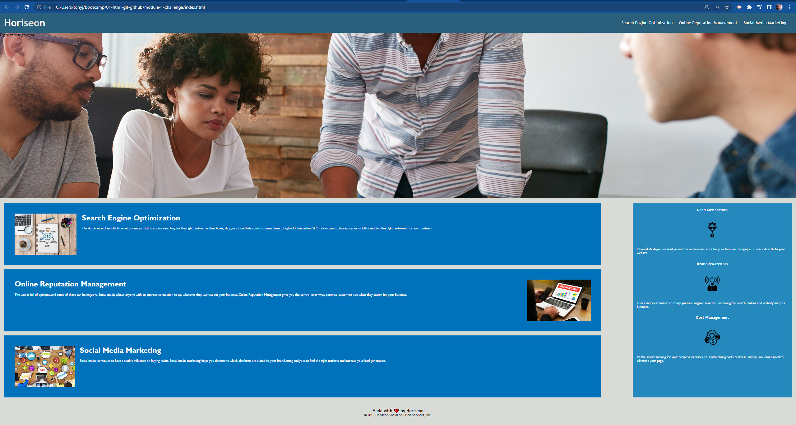

# Horiseon Refactoring Project

## Description

The project's objective was to refactor the Horiseon's site so that 
* the codebase follows accessibility standards
* the site is optimized for search engines

HTML code was restructured to incoporate latest guidelines on the 
 
use of semantic elements.

CSS code was reworked to make it more efficient by consolidating 
 
selectors and properties where appropriate, organizing them to 
 
follow the revised structure of the HTML elements. 

Additionaly, comments were added to the HTML and CSS code to  
allow for readability and maintenance of the code.

Deployed link: [Horiseon Refactoring Project](https://github.com/anthonycroft/module-1-challenge)

Horiseon Landing Page: 

## Installation

NA

## License

MIT Licence
